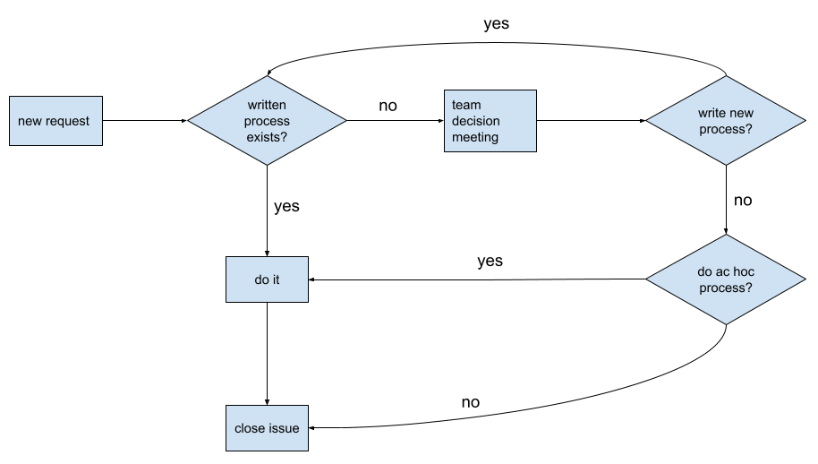

# Syseng Working Agreement

This document outlines the principles, standards, and expectations that we as a team agree to follow in order to work together effectively and efficiently. By establishing a shared understanding of how we operate, we can reduce misunderstandings and conflicts, improve our collaboration, and ultimately deliver high-quality software.
This working agreement is a living document that may evolve over time as our team grows and changes. We encourage everyone on the team to contribute to the ongoing refinement and improvement of this document, so that it remains relevant and useful to us all.

## Meetings

We agree to:

- Start meetings on time
- End meeting meetings on time
- Always have an agenda

## Project Management

We value project management and related processes only as a means for getting work done more efficiently and effectively. As such, while we strive to keep project management processes as light as possible, we agree to the following:

### Issues

The issue is the standard unit of work for the Syseng Pod. As a geographically-dispersed remote team, issues make work visible and facilitate asynchronous communication and collaboration. Issues drive our work, and we agree to these principles of issue-driven development:

- Create an issue to track work before any work starts
- Link every PR to a Github issue
  - If the issue originated in an issue tracker other than Github (e.g. Jira, Bugzilla), create a Github issue that references the ticket in the external system.
- Issues are, by order of preference:
  - Github issues
  - Jira tickets
  - Bugzilla bugs
- Convert meeting action items, code comments, and comments in code reviews to issues when appropriate

### Planning

- Prioritize security issues and critical bugs in our backlog and give them appropriate attention
- Prefer working on tasks that align with our team's current objectives and OKRs
- Keep our project board up to date
- Regularly review issues to determine their completeness (description, labels, etc.) and their prioritization
  - at each Task Review meeting as recurrent agenda item for last 15 minutes
  - as ad hoc sessions for extended review
- Use labels to facilitate async issue review
  - `needs-triage` - hasn’t been reviewed, placed on board
  - `needs-decision` - requires group discussion and assent before work starts

## Customer Relations

We agree to:

- Establish a public Slack channel as the "process entrypoint" for each project, where team members and customers can discuss and coordinate work
- Redirect direct messages to public communication channels whenever possible, and use the following channels in order of preference:
  - issue comments,
  - public Slack channels
  - email
- Funnel customer requests into issues, and guide customers to create the issue themselves when possible, but provide assistance when necessary
- Acknowledge all customer requests within 24 hours
- Use the “decision algorithm” (see below) to respond to customer requests

## Software Engineering Practices

Where applicable, we agree to adhere to the quality standards defined in [SysEng Software Quality](https://docs.google.com/document/d/1m96FOH8Dv87m3OtjBT14C969gjhcMygZmrPpx5e7A2Y/). In addition, we agree to:

### Code Quality

- Ensure test cases are added, modified, or deleted in accordance with code changes
- Allow no hard-coded values for anything related to self-service (eg. list of newsletters slugs)
- Use “campsite rules” (leave the codebase better than you found it) in addition to the regular work that we do
- Maintain quality when it’s established
- Prefer designs with self service over manual intervention by admins / operators (eg. YAML files over UI behind VPN)

### PR Practices

- Allow the author of a PR to merge it
- Keep PRs focused on one “main idea”
- Maintain a clean commit history for large PRs to facilitate a smooth review process
- Prefer merge and follow-up commits over rebase/force pushing once a review is requested
- Request review/feedback at any time and suggest specific areas for review for anything less than "ready to merge"
- Use checkboxes to track milestones of completeness for incomplete/draft PRs
- Provide a review within 72 hours of being tagged for review, preferably before the author's next workday cycle. The review does not need to be comprehensive
- Tag specific reviewers when needed

## Information Architecture

Where applicable, we agree to adhere to the quality standards defined in [SysEng Software Quality](https://docs.google.com/document/d/1m96FOH8Dv87m3OtjBT14C969gjhcMygZmrPpx5e7A2Y/). In addition, we agree to:

- Document decisions and processes in permanent places, avoiding Slack and other temporary communication channels
- Prefer the most open/public scope possible for information
- Store documentation as close to the repository as possible, such as in a dedicated docs/ folder instead of in external tools like Google Docs
